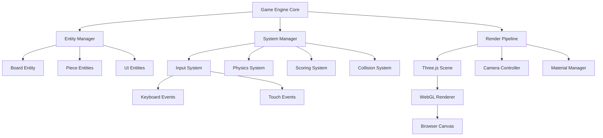

# Design Specification: Tetris 3D MVP

## Overview
Creating a browser-based 3D Tetris game that translates classic 2D gameplay mechanics into an immersive 3D environment using Three.js. The MVP focuses on core Tetris functionality with modern 3D visuals while maintaining familiar gameplay patterns.

## Recommended Approach
Implement a pure client-side 3D Tetris using Three.js with Entity-Component-System architecture, fixed timestep game loop, and orthographic camera for gameplay clarity. Use instance rendering for performance and object pooling to manage memory efficiently.

## Key Technical Decisions

### 1. 3D Framework & Rendering
- **Options Considered**: Three.js vs Babylon.js vs WebGL direct vs Unity WebGL
- **Tradeoffs**: Three.js: extensive ecosystem, lighter weight; Babylon.js: more features, heavier; WebGL direct: maximum control, high complexity; Unity: overkill for 2D-to-3D port
- **Recommendation**: Three.js - optimal balance of features, performance, and development speed for MVP scope

### 2. Camera Type & Perspective
- **Options Considered**: Orthographic vs Perspective vs Hybrid approach
- **Tradeoffs**: Orthographic: clear grid alignment, familiar 2D feel; Perspective: immersive 3D depth, potential disorientation; Hybrid: complex implementation
- **Recommendation**: Orthographic camera - maintains gameplay clarity while providing 3D visual depth (addresses REQ-6)

### 3. Grid Architecture
- **Options Considered**: Traditional 10×20×1 vs True 3D multi-depth vs Dynamic depth
- **Tradeoffs**: 10×20×1: familiar mechanics, simpler logic; Multi-depth: innovative gameplay, complex collision detection; Dynamic: adaptive complexity
- **Recommendation**: 10×20×1 grid following standard Tetris specifications - maintains core gameplay familiarity for MVP

### 4. Build System & Development Stack
- **Options Considered**: No-bundler (vanilla) vs Vite+TypeScript vs Webpack+Babel
- **Tradeoffs**: No-bundler: simple deployment, limited tooling; Vite+TypeScript: modern DX, type safety; Webpack: mature, complex setup
- **Recommendation**: Vite with TypeScript - provides type safety and modern development experience without complexity overhead

### 5. WebGL Compatibility Target
- **Options Considered**: WebGL 1.0 minimum vs WebGL 2.0 required vs Progressive enhancement
- **Tradeoffs**: WebGL 1.0: broader compatibility, limited features; WebGL 2.0: better performance, excludes older devices; Progressive: complex feature detection
- **Recommendation**: WebGL 1.0 minimum with WebGL 2.0 enhancements - maximizes browser compatibility while enabling optimizations where available

### 6. Game Architecture Pattern
- **Options Considered**: Object-Oriented vs Entity-Component-System vs Functional programming
- **Tradeoffs**: OOP: familiar structure, tight coupling; ECS: scalable, complex setup; Functional: pure functions, state management challenges
- **Recommendation**: Entity-Component-System - provides clean separation of concerns and scalability for future enhancements

## High-Level Architecture


## Component Design

### Core Components
**Transform Component**: Position, rotation, scale data
**Geometry Component**: Three.js geometry reference and material
**Game Logic Component**: Tetris-specific data (piece type, rotation state)
**Input Component**: Control bindings and response handlers
**Animation Component**: Smooth movement and rotation tweening

### Systems Architecture
**Input System**: Processes keyboard/touch events, updates piece movement
**Physics System**: Handles falling mechanics, collision detection, line clearing
**Render System**: Updates Three.js scene graph, manages instance rendering
**Audio System** (future): Sound effects and music management
**UI System**: Score display, game state overlays, menu management

## Key Considerations

### Performance
Instance rendering reduces draw calls to <50 per frame. Object pooling maintains consistent memory usage during extended play. Orthographic camera eliminates perspective calculations overhead, targeting 60 FPS desktop, 30 FPS mobile.

### Security
Content Security Policy allows Three.js CDN delivery while restricting inline scripts. Client-side architecture eliminates server attack vectors. Input validation prevents malformed game state manipulation.

### Scalability
ECS architecture supports future features (multiplayer, power-ups, themes). Modular system design enables independent feature development. Clean separation between game logic and rendering allows platform porting.

## Technical Stack

### Core Technologies
- **Frontend**: TypeScript 5.0+, Three.js r155+, Vite 4.0+
- **Rendering**: WebGL 1.0/2.0, Canvas API for fallback UI
- **Input**: DOM Events API, GamepadAPI (future enhancement)
- **Storage**: LocalStorage for preferences, IndexedDB for future features

### Development Tools
- **Build**: Vite with TypeScript, ESLint, Prettier
- **Testing**: Vitest for unit tests, Playwright for e2e testing
- **Deployment**: Static hosting (Netlify/Vercel), CDN for assets

### Performance Monitoring
- **Metrics**: FPS counter, memory usage tracking, WebGL context monitoring
- **Analytics**: User engagement events, error tracking, performance benchmarks
- **Optimization**: Dynamic quality adjustment, feature detection with graceful degradation

## Data Models

### Game State Structure
```typescript
interface GameState {
  board: BlockType[][][];        // 10×20×1 grid
  currentPiece: Piece | null;
  nextPiece: Piece;
  score: number;
  level: number;
  lines: number;
  state: GamePhase;
}

interface Piece {
  type: PieceType;
  position: Vector3;
  rotation: number;
  blocks: Vector3[];
}
```

### Entity Component Data
```typescript
interface Entity {
  id: string;
  components: Map<ComponentType, Component>;
}

interface Transform extends Component {
  position: Vector3;
  rotation: Euler;
  scale: Vector3;
}

interface TetrisLogic extends Component {
  pieceType: PieceType;
  rotationState: number;
  fallSpeed: number;
  lockDelay: number;
}
```

## Success Criteria

### Functional Requirements
- All 7 Tetris pieces (I,O,T,S,Z,J,L) render and rotate correctly in 3D space
- Line clearing detection and animation work across all scenarios
- Scoring system matches traditional Tetris point values and level progression
- Game over detection triggers when pieces reach grid ceiling

### Performance Requirements  
- Maintain 60 FPS on desktop browsers (Chrome 80+, Firefox 75+, Safari 13+)
- Achieve 30 FPS minimum on mobile devices with WebGL support
- Initial load time under 3 seconds on standard broadband connections
- Memory usage stable during 30+ minute gameplay sessions

### Quality Requirements
- Zero game-breaking bugs in core mechanics (movement, rotation, line clearing)
- Input lag under 16ms for responsive piece control
- Visual clarity maintained across target screen sizes (320px - 2560px width)
- Graceful degradation when WebGL features unavailable

## Implementation Phases

### Phase 1: Core Foundation (Week 1)
- Vite + TypeScript project setup
- Three.js scene initialization with orthographic camera
- ECS architecture implementation
- Basic input system for keyboard controls

### Phase 2: Game Logic (Week 2-3)
- Tetris piece generation and rotation algorithms
- Collision detection and boundary checking
- Line clearing mechanics and scoring system
- Game state management (start, play, pause, game over)

### Phase 3: 3D Rendering (Week 4)
- Instance rendering for game blocks
- Smooth animation system for piece movement
- Visual effects for line clearing
- UI overlay integration with Three.js scene

### Phase 4: Polish & Optimization (Week 5-6)
- Performance profiling and optimization
- Cross-browser compatibility testing
- Mobile responsiveness improvements
- Error handling and edge case resolution